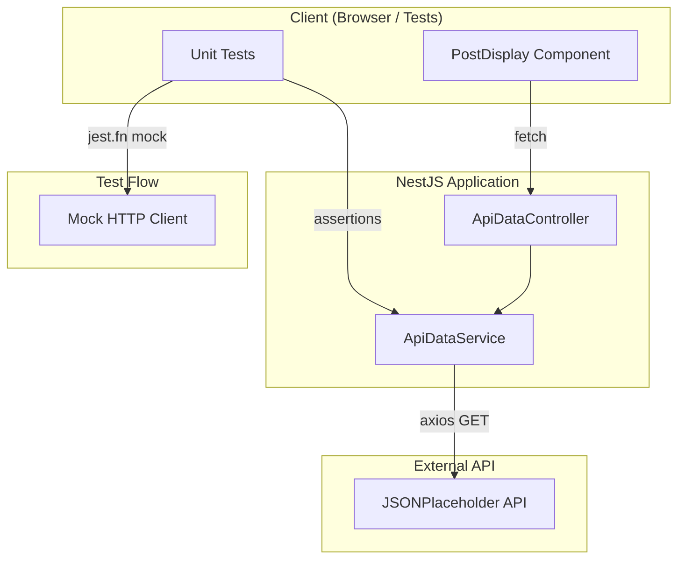
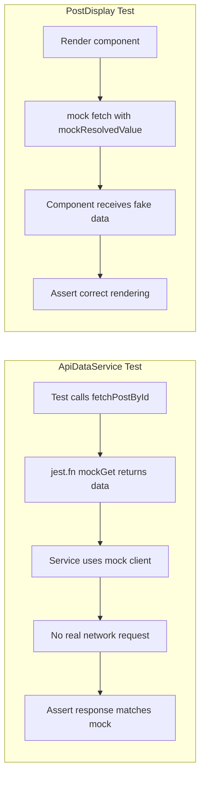

# Test Repository for Mocking API Calls in Jest

A NestJS application that demonstrates how to mock API calls in Jest for testing asynchronous code. The project includes a backend API, a React component that fetches data, and comprehensive unit tests using `jest.fn()` and mocked HTTP clients.

## Features

- **NestJS Backend API**: REST endpoints for fetching post data from an external API (JSONPlaceholder)
- **ApiDataService**: Service that performs HTTP GET requests using axios, designed for easy mocking in tests
- **PostDisplay React Component**: A React component that fetches and displays a single post from an API
- **Jest Unit Tests**: Tests for both the NestJS service and the React component, with full API call mocking

## Project Structure

```text
.
├── src/
│   ├── main.ts                 # Application entry point
│   ├── app.module.ts           # Root module
│   ├── app.controller.ts       # Root controller (/, /health)
│   ├── app.service.ts          # Root service
│   ├── api-data/               # API data fetching module
│   │   ├── api-data.module.ts
│   │   ├── api-data.controller.ts
│   │   ├── api-data.service.ts
│   │   └── interfaces/
│   │       └── api-post.interface.ts
│   └── components/
│       └── PostDisplay.tsx     # React component that fetches and displays posts
├── test/
│   ├── api-data.service.spec.ts  # ApiDataService tests with mocked axios
│   ├── post-display.spec.tsx     # PostDisplay React component tests with mocked fetch
│   └── jest-setup.ts             # Jest setup for jest-dom
├── jest.config.ts
├── nest-cli.json
├── tsconfig.json
└── Doxyfile
```

## Dependencies

### Production

- `@nestjs/common`, `@nestjs/core`, `@nestjs/platform-express`: NestJS framework
- `axios`: HTTP client for API requests
- `reflect-metadata`: Decorator metadata for NestJS
- `rxjs`: Reactive extensions
- `react`, `react-dom`: React for the PostDisplay component

### Development

- `@nestjs/cli`: NestJS CLI (version 11.0.16)
- `@nestjs/testing`: NestJS testing utilities
- `jest`, `ts-jest`, `jest-environment-jsdom`: Jest and TypeScript support
- `@testing-library/react`, `@testing-library/jest-dom`: React component testing
- `typescript`: TypeScript compiler
- `eslint`, `@typescript-eslint/*`: Linting

## Code Change Summary

1. **Project Setup**: Created NestJS project structure with package.json, tsconfig.json, nest-cli.json
2. **ApiDataService**: Implemented service using axios to fetch posts from JSONPlaceholder API, with `createWithClient()` factory for test injection
3. **ApiDataController**: Exposed GET `/api/posts` and GET `/api/posts/:id` endpoints
4. **PostDisplay Component**: React component with loading, success, and error states, using native `fetch`
5. **Unit Tests**: ApiDataService tests mock axios via `jest.fn()`, PostDisplay tests mock global `fetch`
6. **Jest Configuration**: Added jsdom environment, tsx support, and jest-setup for React tests

## Flowchart



### Test Mocking Flow



## Running the Application

### Development server

```bash
npm run start:dev
```

The application listens on port 3000 by default. Environment variable `PORT` can override this.

### Build

```bash
npm run build
```

### Production mode

```bash
npm run start:prod
```

## Testing

### Executing all unit tests

```bash
npm test
```

### Executing tests in watch mode

```bash
npm run test:watch
```

### Executing tests with coverage

```bash
npm run test:cov
```

### What the tests verify

- **ApiDataService**: Success and error paths for `fetchPostById` and `fetchAllPosts` with mocked axios client
- **PostDisplay**: Loading state, successful data display, and error handling with mocked `fetch`

## Debugging

1. **Start the dev server** and use `console.log` or breakpoints in your IDE
2. **Run tests in watch mode** (`npm run test:watch`) to re-run on file changes
3. **Use `--verbose`** for more output: `npm test -- --verbose`
4. **Debug a single test file**: `npm test -- test/api-data.service.spec.ts`
5. **Generate coverage** to see which lines are tested: `npm run test:cov`

## API Endpoints

| Method | Path             | Description                |
| :----- | :--------------- | :------------------------- |
| GET    | /                | Welcome message            |
| GET    | /health          | Health check with timestamp|
| GET    | /api/posts       | All posts from external API|
| GET    | /api/posts/:id   | Single post by ID          |

## Environment Variables

| Variable     | Description               | Default                            |
| :----------- | :------------------------ | :--------------------------------- |
| PORT         | HTTP server port          | 3000                               |
| API_BASE_URL | Base URL for external API | jsonplaceholder.typicode.com       |

## Linting

```bash
npm run lint
```

## Node.js version

Node.js v20 or later is required (see `engines` in package.json).
